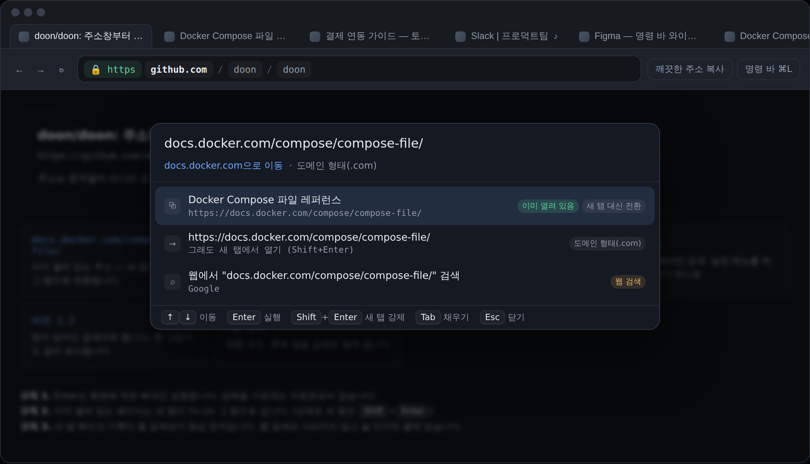

# Doon

> 주소창부터 다시 만든 브라우저.

크롬과 엣지의 주소창은 입력을 확률로 찍고, 그 판단을 Enter 뒤에야 알려주고,
이미 열려 있는 탭을 무시하고 31번째 탭을 연다. 그리고 결과 목록에는
내 기록과 프로모션이 섞여 있다.

Doon의 주소창은 **명령 바(Command Bar)** 다. 규칙이 공개되어 있고, 해석을 미리 보여주고,
내 것이 웹보다 먼저다.



## 세 가지 규칙

1. **Enter는 화면에 적힌 해석만 실행한다.** 입력하는 동안 "지금 Enter를 누르면 무슨 일이
   일어나는지"가 항상 한 줄로 떠 있다. 입력을 가로채는 인라인 자동완성이 없다.
2. **이미 열려 있으면 그 탭으로 간다.** 새 탭은 <kbd>Shift</kbd>+<kbd>Enter</kbd>로 명시할 때만.
3. **내 탭·북마크·기록이 웹 검색보다 먼저다.** 웹 검색은 사라지지 않되 항상 마지막 줄.

## 문법은 네 글자

```
github.com        주소로 판정 → 이동          (근거: 도메인 형태(.com))
버전 1.2          검색어로 판정               (근거: 공백 포함)
!gh doon          GitHub 안에서만 검색
@탭 slack         열린 탭에서만 찾기
@페이지 환불       현재 페이지 안에서 찾기
>탭 정리          명령 실행 (중복 탭 합치기)
?github.com       주소처럼 생겨도 무조건 검색
```

전체 문법: [docs/02-명령바-문법.md](docs/02-명령바-문법.md)

## 실행

```bash
npm run dev     # http://localhost:4173 — 프로토타입
npm test        # 판정·문법·순위 규칙 테스트 29개
```

설치할 의존성이 없다. Node 20 이상이면 그냥 돌아간다.

`npm run dev`로 열리는 화면은 진짜 브라우저가 아니라 **주소창 동작만 그대로 구현한
프로토타입**이다. 가짜 탭 8개(중복 포함), 방문 기록, 북마크가 들어 있다.
<kbd>Ctrl</kbd>/<kbd>⌘</kbd>+<kbd>L</kbd> 또는 <kbd>/</kbd> 로 명령 바를 연다.

## 구조

```
src/core/
  url.js        주소/검색어 판정, 주소 해부(dissect)와 재조립, 탭 동일성 판정
  parse.js      입력 → 의도(intent). 해석 문장과 근거를 항상 같이 돌려준다
  rank.js       의도 + 내 브라우저 상태 → 후보 목록. 점수와 근거가 전부 여기 있다
  registry.js   사이트 별칭, 범위, 명령
  josa.js       한국어 조사 자동 선택 ("열린 탭으로", "북마크로")
src/data/mock.js  프로토타입용 가짜 브라우저 상태
prototype/        가짜 브라우저 셸 (화면과 키보드만 담당)
```

`src/core/`는 브라우저 API에 의존하지 않는 순수 모듈이다.
확장 프로그램이든 Electron 셸이든 그대로 얹힌다.

## 왜 이 순서인가

차별점이 주소창이면, 크로미움을 빌드하기 전에 주소창이 실제로 좋은지부터 확인하는 게 맞다.
그래서 엔진이 아니라 판정 규칙부터 만들었다.

- [문제 정의](docs/00-문제정의.md) — 무엇이 답답한지, 그리고 왜 크롬·엣지는 안 고치는지
- [제품 원칙](docs/01-제품원칙.md) — 기능을 넣을지 말지 결정하는 기준
- [명령 바 문법](docs/02-명령바-문법.md) — 구현과 1:1로 대응하는 명세
- [로드맵과 현실 점검](docs/03-로드맵.md) — 확장 → Electron → 자체 셸, 그리고 냉정한 부분
